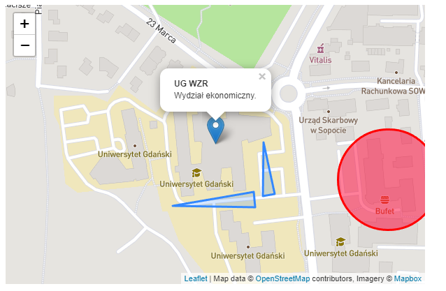

# Leaflet-map

## Table of content
* [General info](#General-info)
* [Images](#Images)
* [Technologies](#Technologies)
* [Setup](#Setup)
* [Features](#Features)
* [Status](#Status)

## General info
Simple map using Leaflet library that allows putting various markers (only in the code) and zones with custom labels. It was made for educational purpose.

## Images

## Technologies
* HTML 5
* JavaScript
* Leaflet library

## Setup
As it is a HTML document all you need is a default text editor like notepad and an internet browser

## Features
* It is a map
* You can put markers by changing the coordinates in code
* You can make zones by changing the coordinates in code
* You can change the starting point by changing the coordinates in code

## Status
As of today the project is complete
